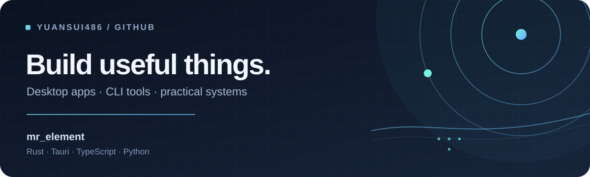

  

 

你好，我是 **mr_element**。最近在参与 Nuphus 的桌面自动化开发，也在打磨本机应用和可靠的命令行工具。

### ✦ 近期项目与协作

| 项目 | 做什么 |
| --- | --- |
| [**Nuphus**](https://github.com/mrpulor-gh/nuphus) | 参与桌面自动化与工作流开发，包括 [UIA 语义自动化基础层](https://github.com/mrpulor-gh/nuphus/pull/52) 和 [工作流运行闭环](https://github.com/mrpulor-gh/nuphus/pull/42)。 |
| [**私匣 Sixa**](https://github.com/yuansui486/sixa) | 基于 Rust、Tauri 和 React 的本机数据脱敏桌面应用；支持文档、图片与 PDF 的识别、复核和导出。 |
| [**Quark Drive CLI**](https://github.com/yuansui486/quark-cli) | 用 Rust 编写的夸克网盘命令行客户端，支持大文件断点续传、目录增量同步和自动化调用。 |

### ✦ 常用工具

`Rust` · `Tauri` · `TypeScript` · `React` · `Python`
